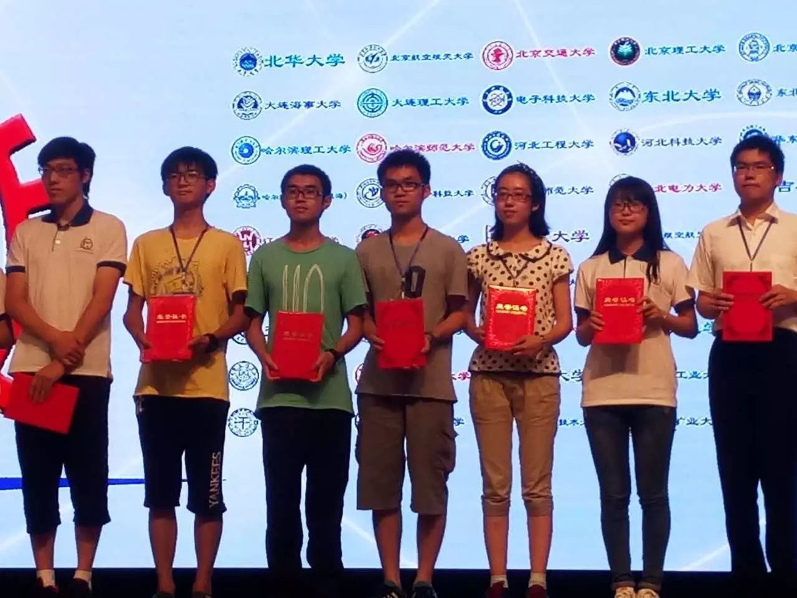

## Lulu Zhou

### About me
<table border="0">
  <tr>
    <td width="75%">
      
<b>Institution: Fudan University</b>

      
<b>Major: Statistics(Data Science)</b>

    </td>
    <td width="25%">
            
    </td>
  </tr>
</table>

### Projects in progress

1. Analysis of blockchain attacks based on reinforcement learning
  * This project aims to analyse the resilience of the bitcoin system to several attacks using MDP model and simulation.
  * [View the project](https://github.com/doris-lessing/Selfish-Mining-Simulator)
  
2. Social network analysis in Chinese rural primary schools
  * We collected questionnaires about the background and social relationships of 227 primary school students when teaching as volunteers. This project focuses on the social network among the students.
  * [View the project](https://github.com/doris-lessing/social-network-mining)
  
3. Image processing algorithms implements
  * This project is meant to implements some classical alogorithms in image processing to get a deeper understanding of them.
  * [View the project](https://github.com/doris-lessing/image-processing)
  
### Education
- **Fudan University:** Undergraduate student at School of Management & School of Data Science
- **University of Toronto:** Exchange student at Computer Science Department
- **Hong Kong Polytechnic University:** Exchange student of product design summer session
- **Duke University:** Summer researcher

### Work Experience
- **Duke Kunshan University:** Teaching Assistant

### Honours

- First prize in CUPT(China University Physics Tournament)

  

- [Cargill global scholarship](https://www.cargillglobalscholars.com/)
