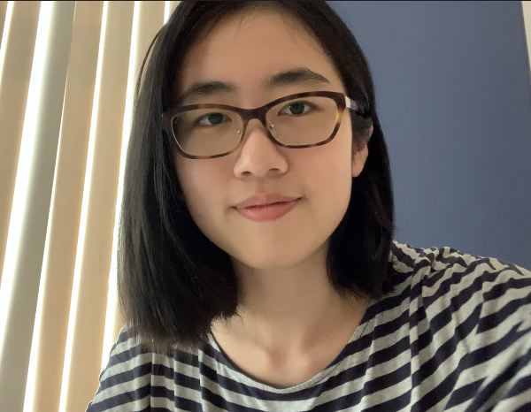

## Lulu Zhou

### About me
<table border="0">
  <tr>
    <td width="75%">
      
<b>Institution: Shanghai Qi Zhi Institute</b>

      
<b>Major: Statistics </b>

    </td>
    <td width="25%">
            
    </td>
  </tr>
</table>

### Projects in progress:
1. Optimization of payment network channel
  * Supervised by professor Zhixuan Fang, Tsinghua University

### Earlier projects:

1. Analysis of blockchain mining strategy based on MDP
  * This project aims to analyse the best way to mining in proof of work blockchain in order to make maximum profit.
  * [View the project](https://github.com/doris-lessing/Selfish-Mining-Simulator)
  * [View my thesis](https://github.com/doris-lessing/Blockchain_attack_MDP) (This page shows main idea and results, thesis in the repository was written in Chinese.)
  
2. Image processing algorithms implements
  * This project is meant to implements some classical alogorithms in image processing to get a deeper understanding of them. This is a homework project.
  * [View the project of image transformation](https://github.com/zhangyilang/ImageTransform)
  * [View the project of threshholding and interpulation](https://github.com/doris-lessing/image-processing)
  
3. Spark project: Turkey's population data analysis
  * Analyse the data using Spark. This is a homework project.
  * [View the project](https://github.com/doris-lessing/spark_project)
  
4. Social network analysis on Bilibili
  * Crawled data from bilibili.com, analyzed the social network of bilibili.
  * [View the paper](https://github.com/doris-lessing/Social_Network_Mining_on_Bilibili/blob/master/Social%20network%20analysis%20and%20reference%20system%20construction%20on%20Bilibili.pdf)
5. Social network analysis in Chinese rural primary schools
  * We collected questionnaires about the background and social relationships of 227 primary school students when teaching as volunteers. This project focuses on the social network among the students.
  * [View the project](https://github.com/doris-lessing/social-network-mining)
  
### Education
- **Fudan University:** Undergraduate student at School of Management
- **University of Toronto:** Exchange student of Art and Science
- **Hong Kong Polytechnic University:** Exchange student of product design summer session

### Work Experience
- **Duke Kunshan University:** Teaching Assistant
- **Shanghai Qi Zhi Institute:** Researcher

### Honours

- First prize in CUPT (China University Physics Tournament)

  

- [Cargill global scholarship](https://www.cargillglobalscholars.com/)
